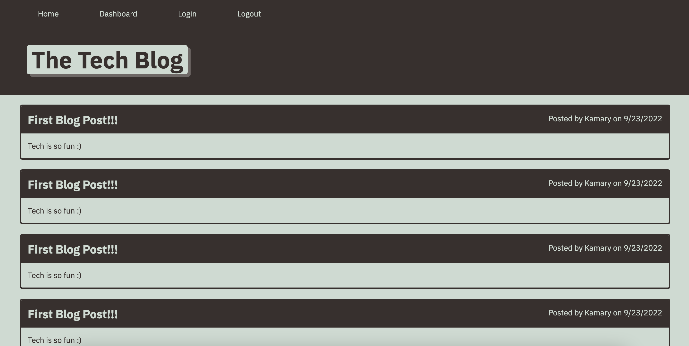

# mvc-tech-blog

## Description

This is a tech blog. When the user opens the website. The can view their homepage in order to see other users post and comments. If the user logs in, they can then view all their posts on their dashboard. From here, they can also update/edit the post and delete them by simply clicking on the post. If the user wants to make a new post, they can also do this from the dashboard by clicking the new post button at the bottom of the screen. If the user is done posting for the day, then they can hit the logout button at the top to be logged out.

#### Application Link

[Deployed Application](https://afternoon-ravine-59350.herokuapp.com/)

## Screenshot of Deployed Application

## Questions

  If you have any further questions, 
   - You can email me at: kami.gillespie@gmail.com
   - You can find my GitHub at: [kamarygillespie4](https://github.com/kamarygillespie4)